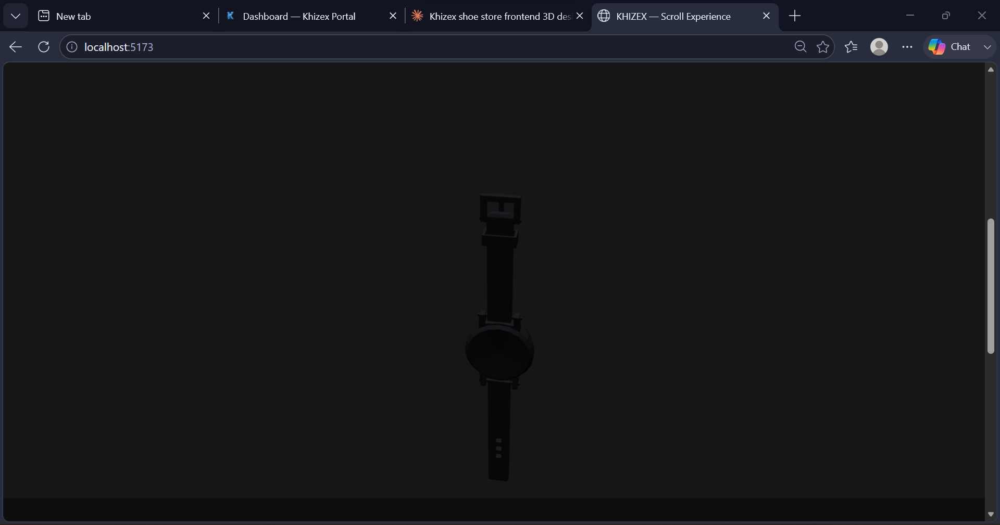
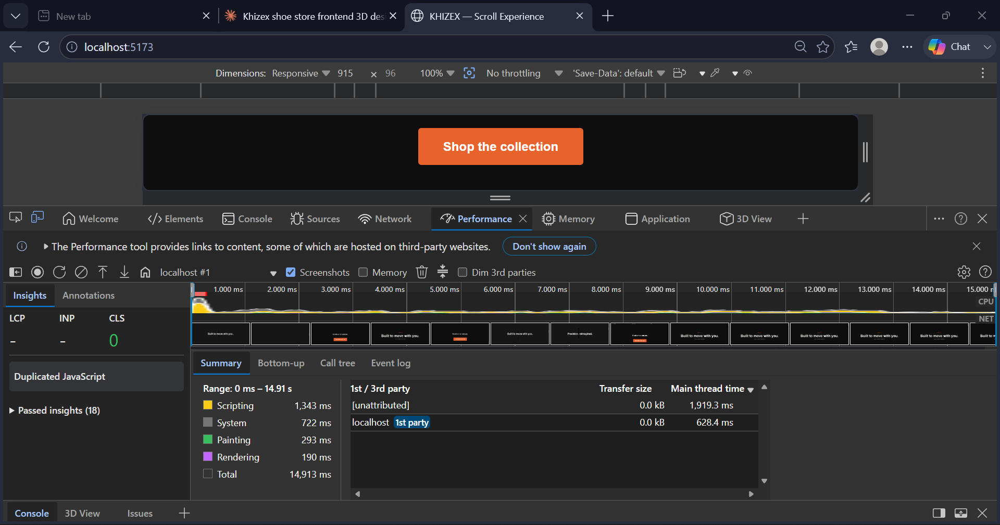
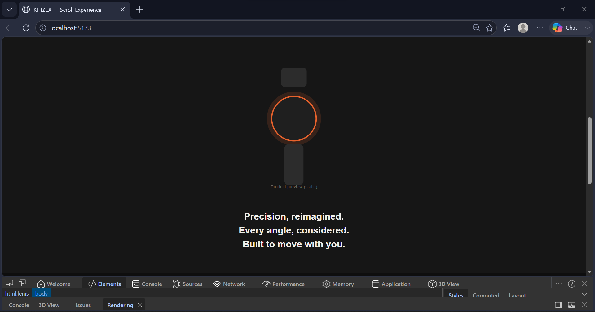

# KHIZEX — Demo Walkthrough

A walkthrough of the scroll-driven 3D sequence, the performance profile,
and the reduced-motion fallback, based on my own local testing. All
screenshots below are from that testing, not mockups.

## The scroll-driven model

Scrolling into the pinned section locks it full-viewport and the watch
model starts responding directly to scroll position — rotating,
lifting slightly, and the camera pulling in and out — rather than
playing on its own timer. Scrolling back up reverses the exact same
motion instead of just replaying it from the start.

Narrative text lines ("Precision, reimagined." / "Every angle,
considered." / "Built to move with you.") fade in and out at specific
points along that same scroll progress, not just whenever they happen
to enter the viewport.

## Performance during scroll

I profiled a fast scroll through the pinned section using Chrome
DevTools' Performance panel. Across roughly 15 seconds of recording,
scripting time came out to about 9% of the total — no long tasks
blocking the main thread, and painting/rendering stayed low as well.
The 3D scene is also lazy-loaded and only mounts once the section
scrolls into view, and its render loop pauses entirely once the section
scrolls back out of view.

## Reduced-motion fallback

With `prefers-reduced-motion: reduce` emulated (Chrome DevTools →
Rendering tab), the pinned 3D experience is replaced entirely by a
static image and the same three lines of copy, all visible at once, no
pinning and no scroll-tied animation. This same fallback also triggers
automatically on devices without WebGL support or with low reported
memory — `useReducedExperience()` checks all three signals before any
3D setup happens at all.

## Keyboard and accessibility

Tabbing once from the top of the page reveals a "Skip 3D showcase"
link, letting keyboard and screen-reader users jump straight past the
long pinned section to the rest of the page. Separately, scrolling with
just the keyboard (Page Down / arrow keys) drives the exact same
choreography as mouse or trackpad scroll, since the underlying
ScrollTrigger reads actual scroll position rather than listening for a
specific input device.

## Summary

| Requirement | Status |
|---|---|
| Scroll-driven model rotation/position, both directions | ✅ |
| Camera movement responds to scroll | ✅ |
| Pinned section with synced text reveals | ✅ |
| Lazy-loaded 3D scene, paused off-screen | ✅ |
| Smooth scrubbing under fast scroll, no snapping | ✅ |
| Resize-safe pin boundaries | ✅ |
| No-WebGL / reduced-motion / low-memory fallback | ✅ |
| Keyboard-reachable, screen-reader-safe content | ✅ |
| Strict TypeScript, zero `any` | ✅ (verified via `npx tsc -b --force`) |
